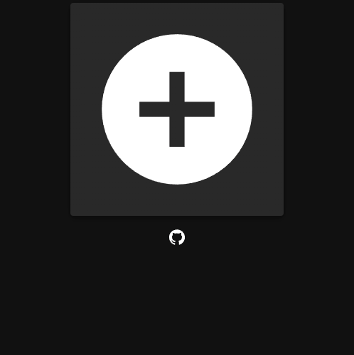

# Multi Chess Clock

  

Ever played a board game where one or two players dominate the time played with
endless [analysis
paralysis](https://boardgamegeek.com/thread/1165170/analysis-paralysis)? No
more! Just as a [chess clock](https://en.wikipedia.org/wiki/Chess_clock) can be
used to prevent matches from stretching into infinity, this app can help
curtail all of those protracted turns and ensure analysis equality for as many
players as fit around your table. Simply enter player names in [round
robin](https://en.wikipedia.org/wiki/Round-robin_scheduling) order, specify a
maximum play time per player, and get playing!
